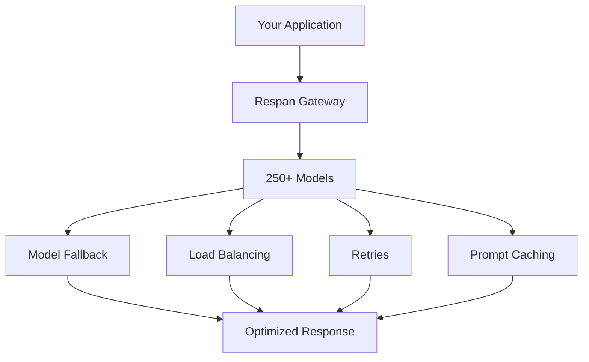

## What is Respan?
Respan is a **full-stack LLM engineering platform** that helps developers and PMs build reliable AI products 10x faster. In a shared workspace, product teams can **trace**, **monitor**, **evaluate**, and **optimize** AI performance.

## Features

### Observability

Monitor, trace, and understand your LLM applications with full visibility into performance, costs, and user interactions.

<Tabs>
  <Tab title="Monitoring">
    Track your LLM applications in real-time with comprehensive dashboards for performance, costs, latency, and error rates.

    <Frame className="rounded-md">
      <video
        controls
        className="w-full aspect-video"
        poster="https://keywordsai-static.s3.us-east-1.amazonaws.com/respan_landing/respan/monitor.png"
        src="https://keywordsai-static.s3.us-east-1.amazonaws.com/respan_landing/respan/monitor.mp4"
      ></video>
    </Frame>
  </Tab>

  <Tab title="Tracing">
    Visualize and debug complex agent workflows with detailed trace trees showing every step, tool call, and LLM interaction.

    <Frame className="rounded-md">
      <video
        controls
        className="w-full aspect-video"
        poster="https://keywordsai-static.s3.us-east-1.amazonaws.com/respan_landing/respan/trace.png"
        src="https://keywordsai-static.s3.us-east-1.amazonaws.com/respan_landing/respan/trace.mp4"
      ></video>
    </Frame>
  </Tab>

  <Tab title="User Analytics">
    Understand how users interact with your AI product. Track user sessions, satisfaction, and usage patterns to improve the experience.

    <Frame className="rounded-md">
      
    </Frame>
  </Tab>
</Tabs>

<CardGroup cols={2}>
  <Card
    title="Logging quickstart"
    icon="file-lines"
    href="/documentation/getting-started/quickstart/logging"
  >
    Send your existing LLM calls to Respan for observability
  </Card>
  <Card
    title="Tracing quickstart"
    icon="sitemap"
    href="/documentation/getting-started/quickstart/tracing"
  >
    Monitor complex agent workflows step-by-step
  </Card>
</CardGroup>

### Optimize

Iterate on prompts and measure quality with version control, playground testing, and automated evaluations.

<Tabs>
  <Tab title="Prompt Management">
    Isolate prompts from code, collaborate with your team, and iterate faster with version control and playground testing.

    <Frame className="rounded-md">
      <video
        controls
        className="w-full aspect-video"
        poster="https://keywordsai-static.s3.us-east-1.amazonaws.com/respan_landing/respan/optimize.png"
        src="https://keywordsai-static.s3.us-east-1.amazonaws.com/respan_landing/respan/optimize.mp4"
      ></video>
    </Frame>
  </Tab>

  <Tab title="Evals">
    Test and measure your AI outputs systematically with evaluators, datasets, and experiments.

    <Frame className="rounded-md">
      <video
        controls
        className="w-full aspect-video"
        poster="https://keywordsai-static.s3.us-east-1.amazonaws.com/respan_landing/respan/evaluate.png"
        src="https://keywordsai-static.s3.us-east-1.amazonaws.com/respan_landing/respan/evaluate.mp4"
      ></video>
    </Frame>
  </Tab>
</Tabs>

<CardGroup cols={2}>
  <Card
    title="Prompt management quickstart"
    icon="wand-magic-sparkles"
    href="/documentation/getting-started/quickstart/prompt_management"
  >
    Create, version, and deploy prompt templates with team collaboration
  </Card>
  <Card
    title="Evaluation quickstart"
    icon="chart-simple"
    href="/documentation/getting-started/quickstart/evaluation"
  >
    Set up automated testing with evaluators, datasets, and experiments
  </Card>
</CardGroup>

### Gateway

Interface with 250+ LLMs via one unified API with built-in load balancing, fallbacks, retries, and prompt caching.

<CardGroup cols={1}>
  <Card
    title="AI gateway quickstart"
    icon="route"
    href="/documentation/getting-started/quickstart/gateway"
  >
    Connect to 250+ models with unified API, fallbacks, and cost optimization
  </Card>
</CardGroup>

## Why Respan?

Respan is the **only platform** that combines AI Gateway, Observability, Prompt Management, and Evaluations in one unified solution. Unlike other tools that focus on single aspects of LLM development, we provide everything you need to build, monitor, and improve AI applications.

<CardGroup cols={2}>
  <Card title="Unified platform" icon="puzzle-piece">
    No need to integrate multiple tools - all core features in one solution
  </Card>
  <Card title="24/7 support" icon="headset">
    Dedicated support team available around the clock
  </Card>
  <Card title="Simple setup" icon="rocket">
    Get started in minutes with our managed platform and straightforward integration process
  </Card>
  <Card title="Enterprise ready" icon="shield">
    SOC 2, GDPR, and HIPAA compliant with enterprise-grade security and scalability built for production environments
  </Card>
</CardGroup>

### Platform comparison

| Feature | **Respan** | Langfuse | Helicone | Braintrust |
|:--------|:---------------:|:--------:|:--------:|:----------:|
| **AI gateway** | ✅ | ❌ | ✅ | Limited |
| **Observability** | ✅ | ✅ | ✅ | ✅ |
| **Prompt management** | ✅ | ✅ | Limited | ✅ |
| **Evaluations** | ✅ | ✅ | ❌ | ✅ |
| **Team collaboration** | ✅ | ✅ | ✅ | ✅ |
| **Setup complexity** | Simple | Hard | Simple | Medium |
| **Hosting** | Managed | Open Source | Managed | Enterprise |
| **Support service** | 24/7 dedicated | GitHub (24-48h) | Contact form | Support center |

## Support

<CardGroup cols={3}>
  <Card
    title="Join Discord"
    icon="discord"
    href="https://discord.com/invite/KEanfAafQQ"
  >
    Connect with our community
  </Card>
  <Card
    title="Book a demo"
    icon="calendar"
    href="https://cal.com/respan"
  >
    Schedule a personalized walkthrough
  </Card>
  <Card
    title="Support center"
    icon="life-ring"
    href="/documentation/support"
  >
    Get help and documentation
  </Card>
</CardGroup>
