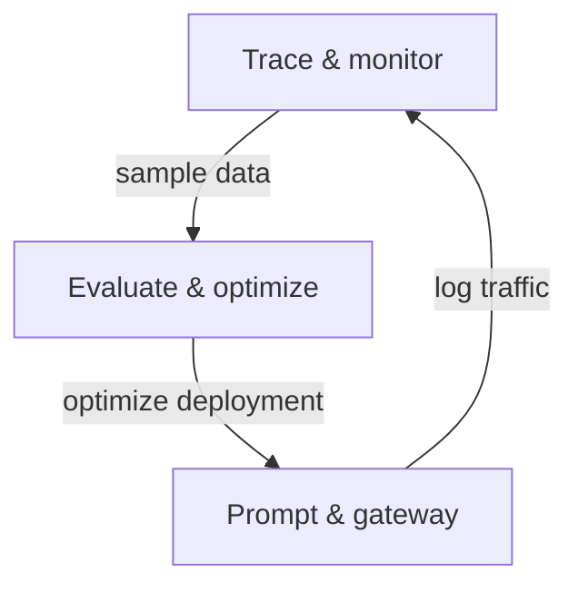
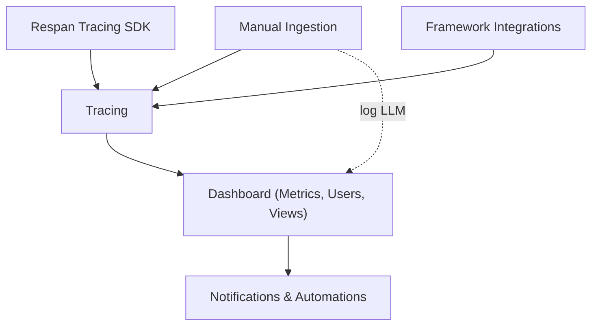
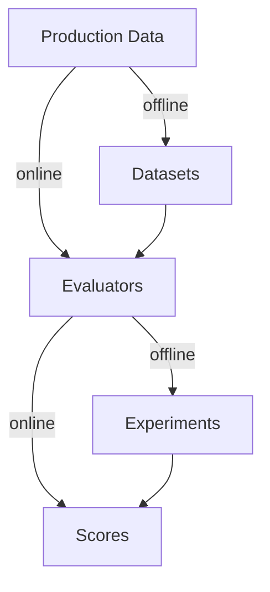
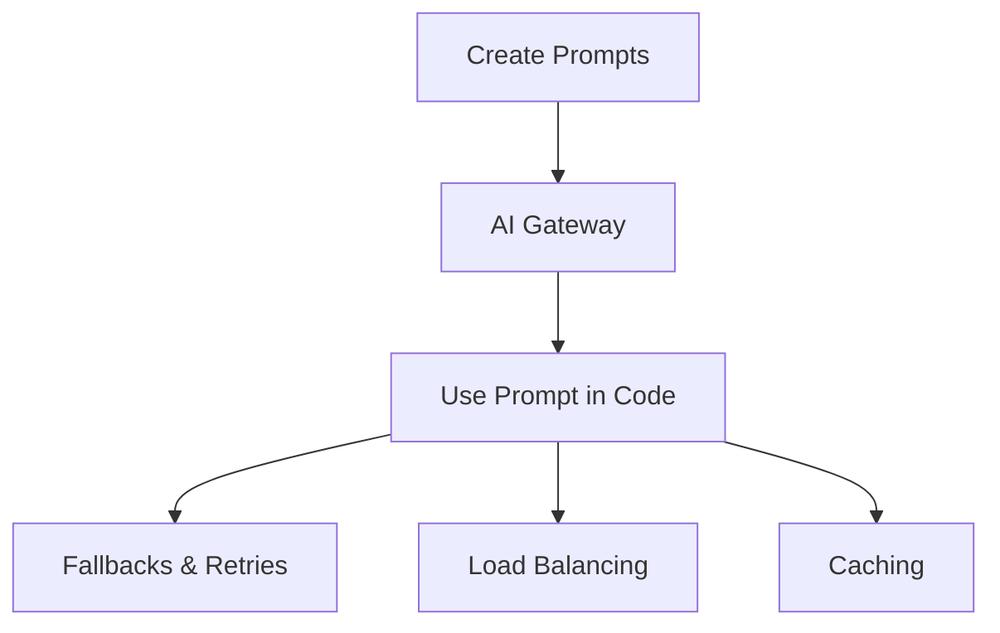

## How Respan works

Everything in Respan is built on one core data structure: the **span**. Every LLM interaction, whether it comes from the tracing SDK, a framework integration, the AI gateway, or a direct API call, is stored as a span with its input, output, model, metrics, and metadata.

Spans form hierarchies called [Traces](/documentation/getting-started/quickstart/tracing) (the execution tree of an agent workflow). They can also group into [Threads](/documentation/features/tracing/logs/log-parameters#threads) (conversations) and carry [Scores](/documentation/features/evals/evaluators) (evaluation results). Every feature in the platform reads from this same span data.

---

## The full workflow

Respan has three workflows that feed into each other:

1. **Trace & monitor** captures production data: agent steps, LLM calls, user interactions.
2. **Evaluate & optimize** turns that data into quality measurements, comparing prompt versions, models, and configurations.
3. **Prompt & gateway** deploys the winning configuration and routes traffic.
4. **Iterate** -- new traffic flows back into tracing, and the cycle repeats.

---

### Trace & monitor

Tracing records the execution tree of your workflows: every agent step, tool call, and model request in one view.

<Tabs>
  <Tab title="Tracing">
    See agent workflows as trace trees with parent-child spans. Each span shows its input, output, latency, and cost.

    <Frame className="rounded-md">
      <video
        controls
        className="w-full aspect-video"
        poster="https://keywordsai-static.s3.us-east-1.amazonaws.com/respan_landing/respan/trace.png"
        src="https://keywordsai-static.s3.us-east-1.amazonaws.com/respan_landing/respan/trace.mp4"
      ></video>
    </Frame>
  </Tab>

  <Tab title="Monitoring">
    Your dashboard shows requests, tokens, latency, cost, and error rates as they happen. Save [Views](/documentation/features/monitoring/views) for filters you reuse, and set [Alerts](/documentation/features/monitoring/notifications/subscribe_alerts) to get notified when something breaks.

    <Frame className="rounded-md">
      <video
        controls
        className="w-full aspect-video"
        poster="https://keywordsai-static.s3.us-east-1.amazonaws.com/respan_landing/respan/monitor.png"
        src="https://keywordsai-static.s3.us-east-1.amazonaws.com/respan_landing/respan/monitor.mp4"
      ></video>
    </Frame>
  </Tab>

  <Tab title="User analytics">
    Pass a `customer_identifier` with your spans to see per-user metrics: usage, cost, and sessions. You can also set [budgets](/documentation/features/user-analytics/customer-identifier) and [rate limits](/documentation/features/user-analytics/customer-identifier) per user.

    <Frame className="rounded-md">
      
    </Frame>
  </Tab>
</Tabs>

**Choose one to get started:**

- [Tracing SDK](/documentation/features/tracing/traces/tracing-sdk): add `@workflow` / `@task` decorators. LLM calls are auto-captured.
- [Framework integrations](/documentation/features/tracing/traces/integration-frameworks): pre-built exporters for OpenAI Agents SDK, Vercel AI, Mastra, LangGraph, and others.
- Manual ingestion:
  - [Ingest traces](/documentation/features/tracing/traces/manual-ingestion): send traces via OTLP or JSON API.
  - [Ingest logs](/documentation/getting-started/quickstart/logging): log individual LLM calls.

Production spans feed directly into evaluations. Sample real traffic into datasets, run evaluators on live spans via [automations](/documentation/features/monitoring/automations/quickstart), or set up alerts to catch regressions after prompt changes.

---

### Evaluate & optimize

With production data flowing, you can start measuring output quality. Respan supports two evaluation modes: online (live traffic) and offline (test datasets).

<Tabs>
  <Tab title="Offline evaluation">
    Build datasets from production spans or CSV imports, run them through different prompt versions or models in experiments, and compare evaluator scores side by side.

    <Frame className="rounded-md">
      <video
        controls
        className="w-full aspect-video"
        poster="https://keywordsai-static.s3.us-east-1.amazonaws.com/respan_landing/respan/evaluate.png"
        src="https://keywordsai-static.s3.us-east-1.amazonaws.com/respan_landing/respan/evaluate.mp4"
      ></video>
    </Frame>
  </Tab>

  <Tab title="Online evaluation">
    Run evaluators on live production traffic via [automations](/documentation/features/monitoring/automations/quickstart_online_eval). Flag bad responses automatically and get alerted when quality drops.
  </Tab>
</Tabs>

**The eval pipeline:**

- Online: production data goes directly to [evaluators](/documentation/features/evals/evaluators), which produce scores in real time.
- Offline:
  1. [Build a dataset](/documentation/features/evals/dataset): sample production spans or [import test cases](/documentation/features/evals/testsets) via CSV.
  2. [Set up evaluators](/documentation/features/evals/evaluators): LLM evaluators (an LLM judges quality), code evaluators (a Python function checks format or length), or human evaluators (your team reviews manually).
  3. [Run experiments](/documentation/features/evals/experiments-v2): test your dataset against different prompt versions or models.
  4. Compare scores.

Datasets come from the production spans captured by tracing. Experiment results tell you which prompt version to deploy. Online evaluations feed into monitoring alerts so quality issues surface immediately.

---

### Prompt & gateway

Manage prompts outside your codebase and route LLM traffic through one API.

<Tabs>
  <Tab title="Prompt management">
    Create templates with `{{variables}}`, commit versions, test in the playground, and deploy without code changes. Your application picks up new versions immediately.

    <Frame className="rounded-md">
      <video
        controls
        className="w-full aspect-video"
        poster="https://keywordsai-static.s3.us-east-1.amazonaws.com/respan_landing/respan/optimize.png"
        src="https://keywordsai-static.s3.us-east-1.amazonaws.com/respan_landing/respan/optimize.mp4"
      ></video>
    </Frame>
  </Tab>

  <Tab title="AI gateway">
    Route LLM traffic through a single API for automatic logging, fallbacks, retries, load balancing, and caching. Supports 250+ models across OpenAI, Anthropic, Google, Azure, and others. Change the base URL and you're connected.
  </Tab>
</Tabs>

**Workflow:**

1. [Create prompts](/documentation/features/prompt-management/manage-prompts): create templates, commit versions, compare changes.
2. [Set up gateway](/documentation/features/gateway/quickstart): access 250+ models with one line of code.
3. [Use prompt in code](/documentation/features/prompt-management/manage-prompts#deployment--versioning): reference prompts by ID. Deploy new versions without code changes.
4. [Add fallbacks, retries, load balancing, and caching](/documentation/features/gateway/advanced-configuration): configure reliability and cost optimization for your gateway traffic.

<Note>
The gateway adds ~50-150ms of latency. If latency is critical, use [tracing](/documentation/getting-started/quickstart/tracing) for observability instead of routing through the gateway.
</Note>

All gateway traffic is logged automatically, feeding back into tracing. Prompt variables appear in spans so you can see which version and inputs produced each output. Prompts deployed here are typically tested through the evaluation pipeline first.

---

## Support

<CardGroup cols={3}>
  <Card
    title="Join Discord"
    icon="discord"
    href="https://discord.com/invite/KEanfAafQQ"
  >
    Connect with our community
  </Card>
  <Card
    title="Book a demo"
    icon="calendar"
    href="https://cal.com/team/respan/demo"
  >
    Schedule a personalized walkthrough
  </Card>
  <Card
    title="Support center"
    icon="life-ring"
    href="/documentation/support"
  >
    Get help and documentation
  </Card>
</CardGroup>
